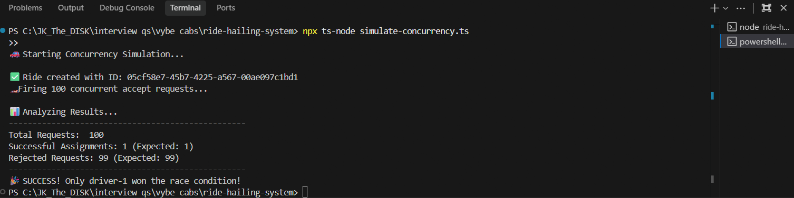
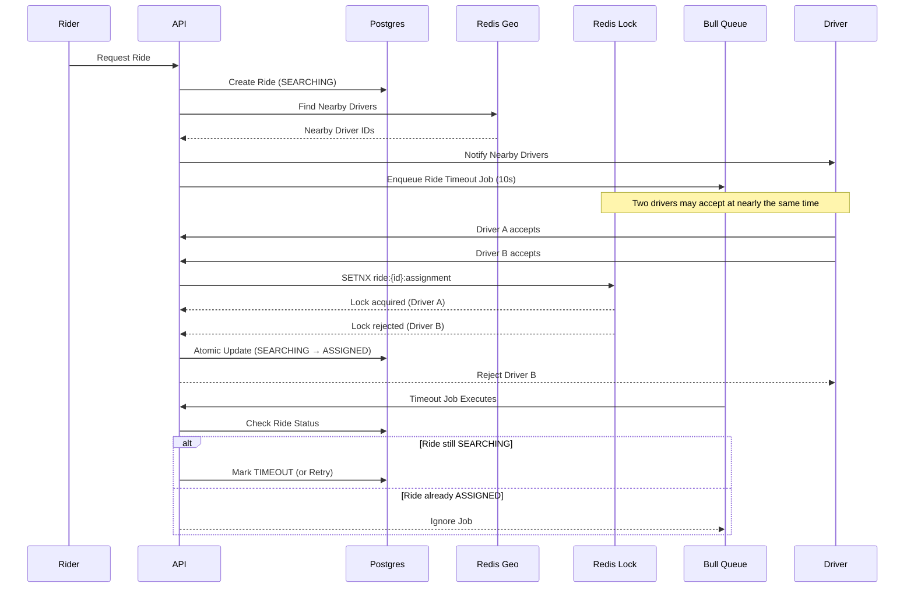

# Real-Time Driver Allocation System

This system simulates the core workflow of a ride-hailing platform with real-time driver allocation under high concurrency. It ensures strict idempotency and race condition prevention using Redis distributed locks.

> **💡 Note for Testing:** A **Postman collection** (`ride-hailing-system.postman_collection.json`) is attached in the root directory of this repository. Import it directly into Postman to easily test all endpoints!

## Tech Stack
- **Framework**: NestJS (TypeScript)
- **Database**: PostgreSQL (via TypeORM)
- **Caching, Geo, & Concurrency**: Redis (via ioredis)
- **Background Jobs**: Bull (Redis-backed Queue)
- **Infrastructure**: Docker & docker-compose


## Overall Flow
1. **Request**: A rider requests a ride.
2. **Geo Search**: The system queries Redis (using `GEOSEARCH`) to discover drivers within a 5km radius of the pickup location.
3. **Notify**: Nearby drivers are notified (simulated).
4. **Acceptance (Concurrency Race)**: Multiple drivers may attempt to accept the ride at the exact same time. The system uses a Redis `SETNX` distributed lock to guarantee that only the **first** driver successfully acquires the ride, preventing double-booking.
5. **Timeout & Retry**: A delayed job is added to a Bull queue. If no driver accepts within 10 seconds, the background worker expands the search radius by 5km and retries.
6. **Expiration**: If the maximum retry limit is reached without an acceptance, the ride is marked as timed out.
## State Management
The ride lifecycle is strictly controlled via PostgreSQL using TypeORM Enums. Edge cases (like a driver accepting just as the timeout fires) are handled safely using atomic database updates.
- `SEARCHING`: The active state while the system alerts drivers and waits for an acceptance.
- `ASSIGNED`: A driver has successfully acquired the lock and the assignment is saved.
- `TIMEOUT`: No driver accepted the ride before the maximum retries were exhausted.


## Setup Instructions

1. **Start the Infrastructure (Postgres & Redis)**
   ```bash
   docker-compose up -d

2. **Install Dependencies**
   ```bash
   npm install

3. **Set up Environment Variables** : Ensure your .env file matches the provided docker-compose.yml.
   ```bash
   PORT=3000
   DB_HOST=localhost
   DB_PORT=5433
   DB_USER=user
   DB_PASSWORD=password
   DB_NAME=ride_hailing
   REDIS_HOST=localhost
   REDIS_PORT=6379

4. **Start the Application**
   ```bash
   npm run start:dev  

Concurrency Verification :
I have included a script to prove that our Redis SETNX-based concurrency handling works perfectly under heavy load. The script fires 100 simultaneous "Accept Ride" requests for the same ride at the exact same millisecond.

Run the simulation:
   ```bash
   npx ts-node simulate-concurrency.ts
```
Expected Output: Exactly 1 driver succeeds, and 99 fail safely, preventing race conditions and double-booking.


## Architecture Overview


