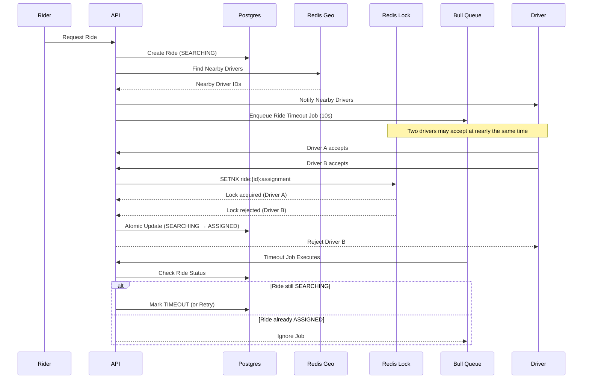

# Real-Time Driver Allocation System

This system simulates the core workflow of a ride-hailing platform with real-time driver allocation under high concurrency. It ensures strict idempotency and race condition prevention using Redis distributed locks.

## Tech Stack
- **Framework**: NestJS (TypeScript)
- **Database**: PostgreSQL (via TypeORM)
- **Caching, Geo, & Concurrency**: Redis (via ioredis)
- **Background Jobs**: Bull (Redis-backed Queue)
- **Infrastructure**: Docker & docker-compose

## Setup Instructions

1. **Start the Infrastructure (Postgres & Redis)**
   ```bash
   docker-compose up -d

2. **Install Dependencies**
   ```bash
   npm install

3. **Set up Environment Variables** : Ensure your .env file matches the provided docker-compose.yml.
   ```bash
   PORT=3000
   DB_HOST=localhost
   DB_PORT=5433
   DB_USER=user
   DB_PASSWORD=password
   DB_NAME=ride_hailing
   REDIS_HOST=localhost
   REDIS_PORT=6379

4. **Start the Application**
   ```bash
   npm run start:dev  

Concurrency Verification :
I have included a script to prove that our Redis SETNX-based concurrency handling works perfectly under heavy load. The script fires 100 simultaneous "Accept Ride" requests for the same ride at the exact same millisecond.

Run the simulation:
   ```bash
   npx ts-node simulate-concurrency.ts
```
Expected Output: Exactly 1 driver succeeds, and 99 fail safely, preventing race conditions and double-booking.


## Architecture Overview


